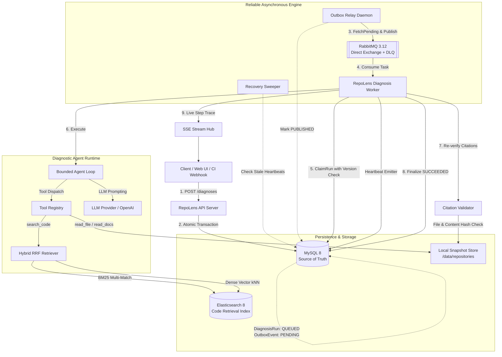
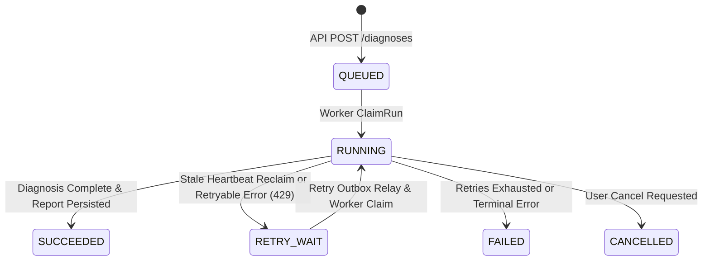
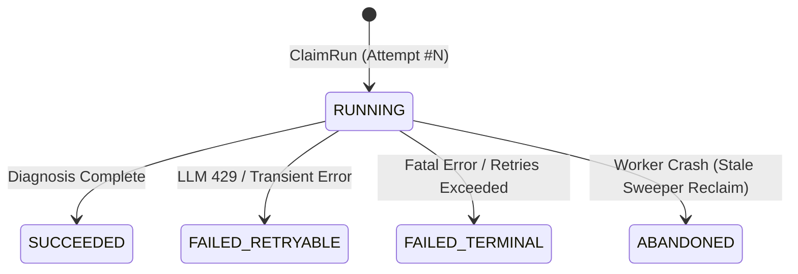

# RepoLens — Reliable AI Repository Diagnosis Platform

> **Reliable Go Backend + Evidence-based AI Codebase Diagnosis Platform.**  
> Given a software repository and an issue / CI error log, RepoLens reliably executes automated root-cause diagnosis and delivers structured, evidence-backed diagnostic reports with verified line-level source code citations.

---

## 1. Why RepoLens?

Most LLM coding tools suffer from two critical flaws:
1. **Unreliable Agent Execution**: Direct synchronous LLM invocations fail under token rate limits, network timeouts, worker crashes, or repeated tool invocation loops, causing lost updates and duplicate charges.
2. **Hallucinated Citations**: LLMs generate plausible-looking file paths and nonexistent line numbers without grounding.

RepoLens solves both problems through **rigorous backend distributed reliability** and **deterministic evidence validation**:
- **Zero-Loss Async Engine**: Transactional Outbox + Relay + RabbitMQ + MySQL optimistic locking ensures guaranteed at-least-once task dispatch with exact-once business execution semantics.
- **Self-Healing Workers**: Periodic heartbeats and background recovery sweeper automatically reclaim abandoned attempts when worker nodes crash.
- **Evidence-Based Citation Validator**: Every citation in the AI diagnostic report is strictly validated against an immutable filesystem snapshot (path existence, line bounds, and SHA256 content hash matching) before persisting to the user.
- **Hybrid Code Retrieval**: Elasticsearch 8 BM25 + Dense Vector kNN search with Go-level Reciprocal Rank Fusion (RRF).
- **32-Case Regression Eval**: Built-in offline evaluation harness measuring File Hit@K, MRR, citation validity rate, and root-cause accuracy across versioned benchmark datasets.

---

## 2. System Architecture



---

## 3. Engineering Highlights

### 1. Transactional Outbox & Message Relay
- **Dual-write Consistency**: `DiagnosisRun` and `OutboxEvent` are written within a single ACID transaction in MySQL.
- **Decoupled Publishing**: A dedicated `Relay` polls pending outbox records ordered by `available_at ASC`, delivers persistent AMQP messages to RabbitMQ, and marks events as `PUBLISHED`.
- **Elimination of Ghost State**: Prevents the classic distributed bug where a task is written to DB but lost when the process terminates before messaging.

### 2. Concurrency Fencing & Worker Claim
- **Optimistic Locking Fencing**: Workers claim queued jobs using conditional updates:
  ```sql
  UPDATE diagnosis_runs 
  SET status = 'RUNNING', version = version + 1, updated_at = NOW() 
  WHERE id = ? AND version = ? AND status IN ('QUEUED', 'RETRY_WAIT');
  ```
- **Mutual Exclusion**: Guarantees that only one worker obtains execution rights, returning `ErrClaimConflict` to concurrent workers.

### 3. Worker Crash Recovery & Stale Sweeper
- **Active Heartbeats**: Active workers run background heartbeat emitters updating `heartbeat_at` on their `DiagnosisAttempt`.
- **Automated Reclaim**: The `RecoverySweeper` queries for running attempts whose heartbeats have expired (> 30s threshold). It marks dead attempts as `ABANDONED`, transitions the run to `RETRY_WAIT`, and transactionally schedules a retry outbox event.

### 4. Transport Redelivery vs. Application Retry
- **Transport Duplicate Delivery**: Handled idempotently at the consumer layer. If a message is redelivered for a completed task (`SUCCEEDED` or `FAILED`), the consumer safely ACKs without re-executing.
- **Application 429 / 5xx Retries**: Handled via state machine transitions to `RETRY_WAIT` with exponential backoff delayed outbox events, ACKing the current AMQP message to prevent RabbitMQ consumer starvation hot-loops.
- **Poison Message Dead-Letter Queue (DLQ)**: Malformed or unprocessable payloads are caught and forwarded to `repolens.diagnosis.dlq`.

### 5. Deterministic Citation Validation
LLM diagnostic findings must provide line-level citations. Before persisting the diagnostic report, the `CitationValidator` performs:
1. **Path Traversal & Symlink Check**: Verifies that the path remains strictly inside the target repository snapshot.
2. **Line Boundary Check**: Asserts $1 \le \text{start\_line} \le \text{end\_line} \le \text{total\_lines}$.
3. **Exact Excerpt & SHA256 Match**: Reads the immutable snapshot on disk, computes the SHA256 content hash, and validates excerpt containment. Citations are tagged `VALID` or `INVALID`.

### 6. Retrieval Pipeline (BM25 Primary & Experimental Hybrid RRF)
- **Production BM25 Search**: Evaluated and selected as the V1 production primary strategy (MRR 0.562). Uses Elasticsearch 8 multi-match with field boosts (`symbol^3.0`, `path^2.0`, `content^1.0`).
- **Experimental Dense Vector & Hybrid Search**: Generates embeddings via `EmbeddingProvider` (Local deterministic feature hashing baseline or OpenAI-compatible `text-embedding-3-small`) queried via ES kNN.
- **Reciprocal Rank Fusion (RRF)**: Merges rank positions in Go using $RRF(d) = \sum \frac{1}{60 + r_i(d)}$ to eliminate score scale mismatches.

---

## 4. State Machines

### DiagnosisRun State Machine


### DiagnosisAttempt State Machine


---

## 5. Retrieval Benchmark & Evaluation

RepoLens includes an offline benchmark runner (`cmd/eval`) evaluated on 32 curated real-world repository fault cases against static repository fixtures without ground-truth leaking:

```text
=========================================================================================================
Retrieval        | Hit@5    | Hit@10   | MRR      | Cit. Valid   | Root Cause   | P50(ms)  | P95(ms) 
---------------------------------------------------------------------------------------------------------
LEXICAL          |    90.6% |    96.9% |    0.883 |       100.0% |         0.0% |       0 |       0
BM25             |    96.9% |   100.0% |    0.895 |       100.0% |         0.0% |       1 |       3
LOCAL_HASHED_VEC |   100.0% |   100.0% |    0.843 |       100.0% |         0.0% |       1 |       3
HYBRID_BASELINE  |    96.9% |   100.0% |    0.866 |       100.0% |         0.0% |       1 |       3
E2E_AGENT        |    96.9% |   100.0% |    0.866 |         0.0% |        15.6% |       2 |       6
=========================================================================================================
```

*Note: `LOCAL_HASHED_VEC` serves as a local deterministic hashing baseline without external network dependencies. Production semantic embeddings utilize OpenAI `text-embedding-3-small` or compatible vector models.*

See [ADR 001: Retrieval Strategy](docs/adr/001-retrieval-strategy.md) for full architectural rationale and trade-off analysis.

---

## 6. Quick Start

### Prerequisites
- Docker & Docker Compose
- Go 1.22+ (for local builds)

### 1. Launch with Docker Compose
```bash
# Clone repository
git clone https://github.com/mrussss/repolens.git
cd repolens

# Configure environment
cp .env.example .env

# Launch all infrastructure services & daemons
docker compose up -d
```

Services initialized:
- **API Server**: `http://localhost:8080`
- **RabbitMQ Management**: `http://localhost:15672` (repolens / repolens_mq_pass)
- **Elasticsearch 8**: `http://localhost:9200`
- **MySQL 8**: `localhost:3306`

### 2. Trigger Diagnosis via API
```bash
# 1. Register a repository
curl -X POST http://localhost:8080/repositories \
  -H "Content-Type: application/json" \
  -d '{
    "name": "payment-service",
    "git_url": "https://github.com/example/payment-service.git"
  }'

# 2. Trigger a diagnosis task
curl -X POST http://localhost:8080/diagnoses \
  -H "Content-Type: application/json" \
  -H "Idempotency-Key: task-req-001" \
  -d '{
    "repository_id": "repo-id",
    "snapshot_id": "snap-id",
    "issue_title": "Nil pointer dereference in payment handler initialization",
    "error_log": "panic: runtime error: invalid memory address or nil pointer dereference"
  }'

# 3. Stream real-time agent execution steps (SSE)
curl -N http://localhost:8080/diagnoses/<id>/stream
```

---

## 7. Testing & Verification

RepoLens enforces strict release-gate checks covering unit tests, race detector verification, integration tests, and eval benchmark regression:

```bash
# Run all unit tests
make test

# Run all tests with Go race detector
make test-race

# Run integration tests (Outbox, Concurrency, Recovery, DLQ, ES)
make test-integration

# Run offline 32-case eval benchmark
make eval

# Complete Release Gate validation
make verify
```

---

## 8. Observability & Metrics

Prometheus metrics are exposed on `GET /metrics` (`cmd/api`):
- `http_requests_total{method, path, status}`: API request counters
- `diagnosis_total`: Total diagnosis runs initiated
- `diagnosis_failed_total{error_type}`: Failed runs count
- `diagnosis_latency_seconds`: E2E diagnosis execution histogram
- `worker_inflight`: Inflight tasks gauge
- `mq_redelivery_total`: Redelivered transport messages
- `application_retry_total`: Application retry count
- `stale_attempt_recovered_total`: Crashed worker attempt recoveries
- `retrieval_requests_total{strategy}`: Retrieval queries counter
- `retrieval_latency_seconds{strategy}`: Retrieval latency histogram
- `tool_calls_total{tool_name, status}`: Agent tool execution counter
- `token_usage_total{type}`: Prompt & completion token counter

---

## 9. Security & Ingestion Boundaries

- **Safe Git Cloner**: Strictly validates remote Git URLs against private IPv4/IPv6 CIDRs (RFC 1918, RFC 3927, loopback, AWS metadata `169.254.169.254`), preventing SSRF.
- **Snapshot Isolation**: Source snapshots are evaluated with `filepath.EvalSymlinks` to prevent symlink directory escapes into the host filesystem.
- **Secret Redaction**: Regex filter automatically sanitizes API keys (`sk-`, `ghp_`, `AKIA...`, Authorization headers) from issue titles, descriptions, and error logs before persistence and prompt dispatch.
- **Bounded Resource Limits**: Enforces repository size bounds (`MAX_REPO_SIZE_MB`), maximum file count (`MAX_FILE_COUNT`), and per-file size caps (`MAX_FILE_SIZE_KB`).

---

## 10. Non-Goals & Architecture Scope

To maintain engineering depth and architectural clarity, the following are explicitly out-of-scope for V1:
- **Redis**: MySQL + RabbitMQ provide complete persistence and transactional guarantees.
- **Kubernetes / Service Mesh**: Single-binary daemons with Docker Compose orchestration.
- **Multi-Agent Swarm / LangGraph**: RepoLens relies on a single, deterministic, bounded Go agent runtime loop with strict error fences.
