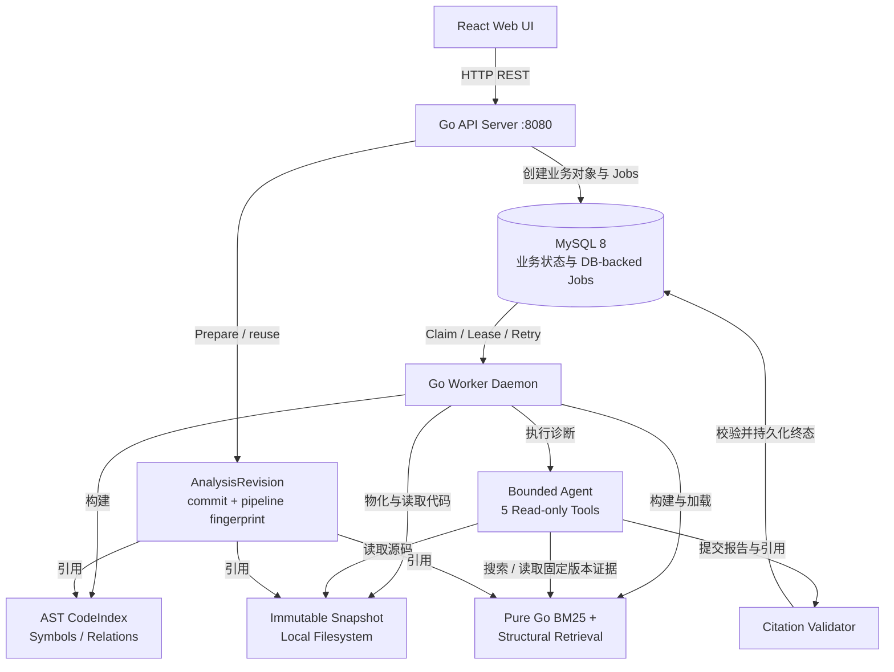

# RepoLens v2.2 架构说明

## 1. 系统总览

RepoLens 是一个本地单用户 Go 代码诊断工具。普通用户只需要选择 Repository、准备一个不可变的 AnalysisRevision，再提交 Diagnosis；Snapshot、CodeIndexBuild 和 RetrievalBuild 是 Revision 内部的可复现 lineage。MySQL 保存业务状态与 DB-backed Analysis Jobs；Worker 按 claim token 和 lease 执行后台任务；受限 Agent 最后校验源码 Citation，并将执行状态与报告质量分开保存。



核心执行顺序是：

```text
Web → API → MySQL → DB-backed Jobs → Worker
    → AnalysisRevision
    → Snapshot → CodeIndex → Retrieval
    → AnalysisRevision READY
    → Diagnosis → Bounded Initial Retrieval → Evidence Packet
    → Bounded Agent → Reserved Finalization Turn
    → Schema / Citation Validation → ReportStatus
```

### 1.1 产品对象与内部 lineage

```text
Repository → AnalysisRevision → Diagnosis
                 │
                 └── Snapshot → CodeIndexBuild → RetrievalBuild
```

`AnalysisRevision` 通过 `(repository_id, exact commit_sha, pipeline_fingerprint)` 做自然身份。`READY` Revision 的三个内部资源必须全部 READY，并且属于同一 repository、commit 和 build lineage；READY 后不再原地替换资源 ID。FAILED Revision 只能通过显式 retry 回到 PREPARING。

## 2. 核心子系统

### 2.1 API Server（`cmd/api`）

- 提供本地单用户 REST API：Provider 设置、仓库注册、AnalysisRevision prepare/get/list/retry、兼容的底层 Snapshot/Build 查询、Diagnosis、历史和 Demo。
- 创建业务对象时同步创建对应的 Analysis Job，避免业务状态与执行任务出现双写间隙。
- Diagnosis 优先接收 `analysis_revision_id`，服务端冻结 Snapshot、CodeIndexBuild、RetrievalBuild、pipeline、Provider 身份和 Agent 配置指纹；旧的三 build ID 请求仅作迁移兼容。
- 提供 `/healthz` 和 Prometheus `/metrics`；实时状态通过 REST 轮询获取，不使用 SSE。
- Revision 和 Diagnosis 状态均以服务端为准；Web 只轮询 PREPARING/QUEUED/RUNNING，READY/终态后停止。

### 2.2 DB-backed Analysis Jobs（`internal/jobs`）

- MySQL 是业务状态和 Analysis Jobs 的事务性来源；本地测试支持 SQLite。
- 当前 Job 类型为 `MATERIALIZE_SNAPSHOT`、`BUILD_CODE_INDEX`、`BUILD_RETRIEVAL` 和 `RUN_DIAGNOSIS`。
- Worker 通过数据库 claim、`worker_id`、`claim_token`、lease 和 heartbeat 获取执行权。
- Reaper 处理过期 lease、重试和终态转换；claim-token fencing 拒绝旧 Worker 的迟到写入。

### 2.3 Worker（`cmd/worker`）

- 从 MySQL claim 可执行 Job，不依赖外部消息队列。
- 执行 Snapshot 物化、AST CodeIndex、Retrieval artifact 和 Diagnosis Agent 任务。
- 业务对象与 Job 的成功、失败、取消终态在带 fencing 的事务中同步落库。

### 2.4 Snapshot 与 Code Intelligence（`internal/indexing`、`internal/codeintel`）

- Snapshot 绑定 exact commit SHA，文件存放在本地 immutable snapshot 目录，并记录 manifest hash、文件数和大小限制。
- CodeIndex 使用 Go AST 与 best-effort `go/types` 生成版本化 Symbol、Relation 和 AnalysisQuality 数据。
- CodeIndexBuild 只允许在固定 Snapshot 上构建，并在完成时校验 Job ownership 与 claim token。

### 2.5 Retrieval（`internal/retrieval`）

- 当前生产路径是进程内的 Pure Go BM25 加 Structural Retrieval。
- BM25 使用代码感知 tokenizer；Structural Retrieval 基于 CodeIndex 的 symbols、references 和 related tests 做确定性扩展与排序解释。
- RetrievalBuild artifact 按 Snapshot、CodeIndexBuild、strategy 和版本固定，并通过 hash 与 READY lineage 校验后加载。
- CodeIndexBuild 持久化文件/包/符号/关系完整度以及 `quality_warnings_json`；symlink、嵌套 module 和 type-check 不完整等情况作为质量数据展示，不静默伪装成完整分析。
- Agent 启动前执行一次有界、确定性的 QueryBuilder 和初始检索，生成含源码 excerpt、行号、分数和召回原因的 Evidence Packet；完整 Error Log 不会直接作为检索 query。

### 2.6 Bounded Agent 与 Evidence（`internal/agent`、`internal/tools`、`internal/evidence`）

- Agent 只能使用受限的只读工具，例如搜索代码、读取文件、读取文档和 CI 日志。
- Agent 的 prompt、tool set、版本、温度和 guard limits 会形成配置指纹。
- Report、Citation 和 Agent Trace 持久化前后都绑定固定 Snapshot/Build lineage；Citation Validator 会重新检查路径、行号和源码内容。
- `ReportStatus` 由服务端确定性推导：`VALID`、`DEGRADED`、`INSUFFICIENT_EVIDENCE` 或 `INVALID`。结构无效时保留 raw output，但不伪装成 Root Cause 或硬编码模型置信度。
- Agent 有独立的 tool、`search_code`、round、evidence packet、tool output 和 finalization 预算；预算耗尽进入不带 Tools 的 `FINALIZE_ONLY` 收尾。Provider 进度会先 checkpoint，避免持久化失败或 Worker 重试重复调用模型。

## 3. 当前部署组件

```text
mysql     事务数据库、业务状态、Analysis Jobs
api       Go REST API 与 Web 静态资源
worker    Go DB-backed Job Worker
```

`docker compose` 只启动以上三个服务以及 Snapshot/Provider 的本地持久化 volume。仓库内容按不可信数据处理，系统不会执行用户仓库的 build、test、generate 或 package install。

## 4. 历史架构边界

以下内容属于 v1.x 或早期实验，不是 v2.2 当前运行时的部署依赖或数据链路：

- RabbitMQ、Transactional Outbox、Outbox Relay 和 AMQP 队列；
- Elasticsearch、Dense Vector、Embedding Provider 和 RRF Fusion；
- SSE 实时事件流；
- v1.x 旧 Auth 体系。

它们只作为迁移背景或历史评测记录保留，不能作为当前启动或扩展 v2.2 的实现依据。相关取舍见 `docs/adr/`。
