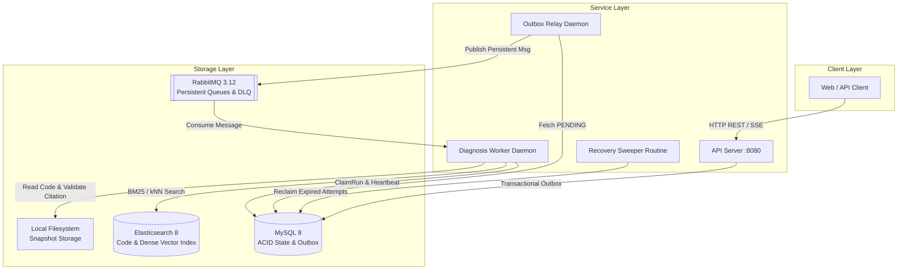

# RepoLens Architecture Specification

## 1. System Overview

RepoLens is an automated software repository diagnostic platform built in Go. It accepts error reports and CI logs, indexes repository snapshots, executes a bounded agent loop with diagnostic tools, verifies file citations against the immutable filesystem, and delivers structured root-cause reports.

---

## 2. Core Subsystems

### 2.1 API Server (`cmd/api`)
- Exposes REST endpoints for user authentication, repository registration, snapshot indexing, and diagnosis task creation.
- Provides Server-Sent Events (`GET /diagnoses/:id/stream`) for streaming live agent steps.
- Exposes Prometheus telemetry on `GET /metrics`.

### 2.2 Transactional Outbox & Relay (`cmd/relay`)
- Employs the Transactional Outbox pattern to solve dual-write inconsistencies between MySQL and RabbitMQ.
- `Relay` polls records ordered by `available_at ASC` and publishes them to RabbitMQ exchange `repolens.direct`.

### 2.3 Async Diagnosis Worker (`cmd/worker`)
- Consumes AMQP messages from `repolens.diagnosis.task`.
- Claims execution rights using optimistic concurrency (`version = version + 1`).
- Runs active heartbeat routines.
- Executes the `AgentLoop` with tool calling (`search_code`, `read_file`, `read_docs`, `read_ci_log`).
- Re-verifies all report citations against the disk snapshot before transitioning run status to `SUCCEEDED`.

### 2.4 Code Retrieval Engine (`internal/retrieval` & `internal/platform/elasticsearch`)
- **BM25 Search**: Multi-match query across `content`, `symbol` (boost 3.0), and `path` (boost 2.0).
- **Dense Vector Search**: Computes embeddings via `EmbeddingProvider` and queries Elasticsearch dense vector kNN.
- **Reciprocal Rank Fusion**: Merges ranking positions deterministically in Go.
