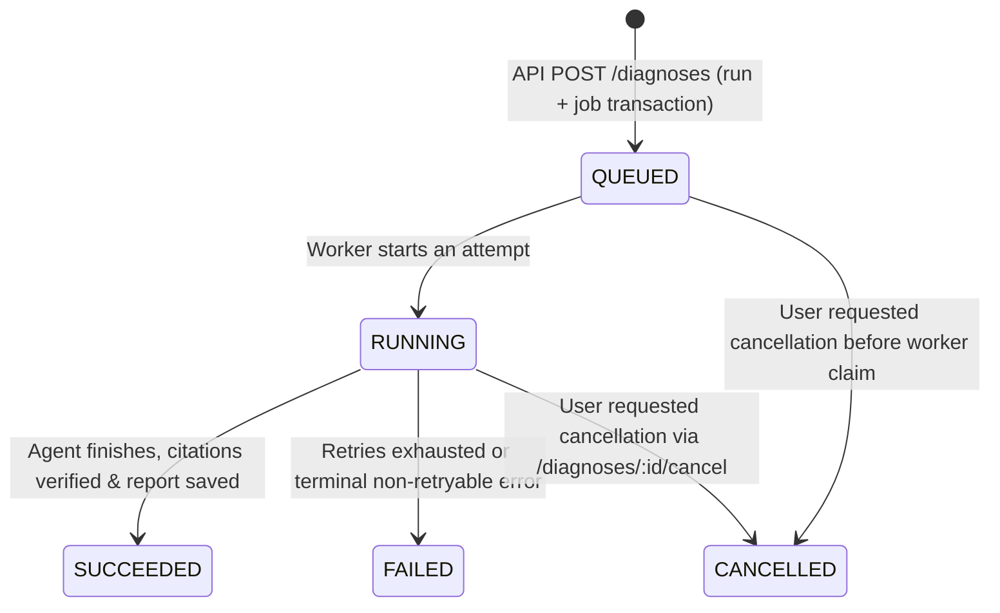
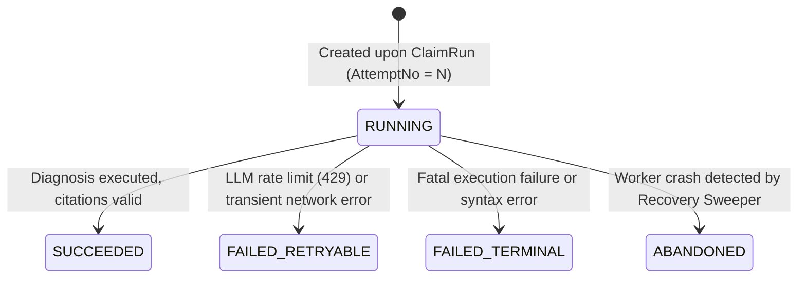

# RepoLens State Machines & Transition Specification

## 1. DiagnosisRun Lifecycle

### Transition Invariants
- `QUEUED`: No worker holds execution rights; retry scheduling belongs to `AnalysisJob`.
- `RUNNING`: The current `DiagnosisAttempt` owns execution progress.
- `SUCCEEDED` / `FAILED` / `CANCELLED`: Terminal states. No subsequent transitions allowed.

---

## 2. DiagnosisAttempt Lifecycle

### Transition Invariants
- `Heartbeat`: Workers must refresh `heartbeat_at` periodically (default: every 5s).
- `ABANDONED`: An attempt marked as `ABANDONED` cannot be resumed by any worker. A new attempt (Attempt #N+1) is spawned instead.
