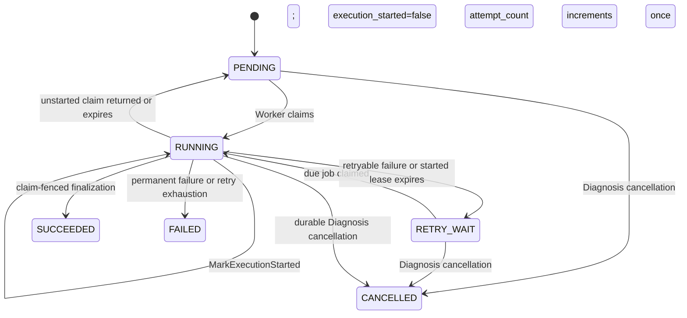
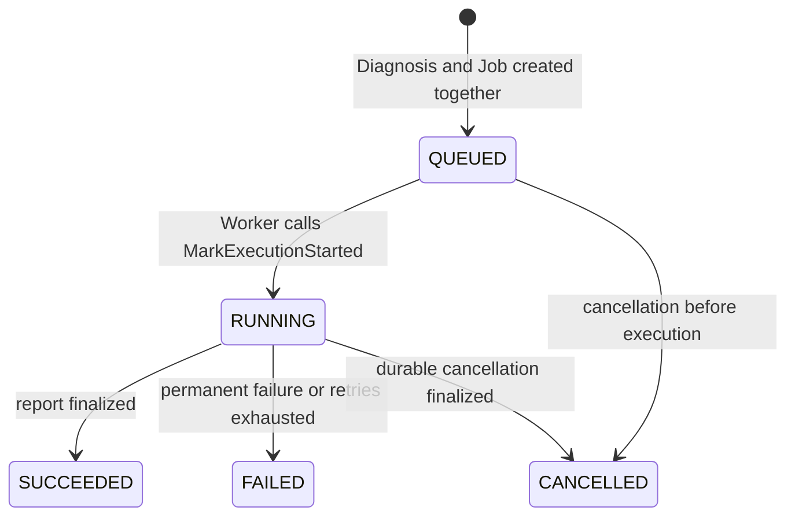
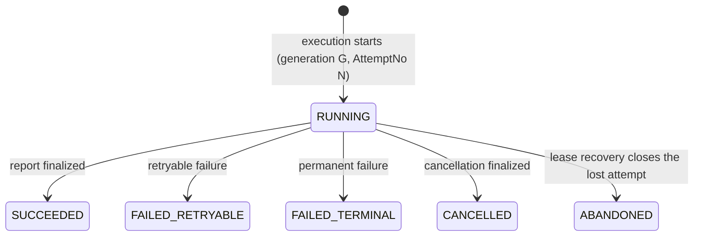

# RepoLens State Machines

This document is the current reference for product pipeline, job execution,
Diagnosis, and attempt state transitions. `AnalysisPipeline` owns product-stage
advancement and finalization. The Worker owns claim and execution lifecycle;
Jobs owns durable execution state and retry/recovery rules.

## Analysis Pipeline

```text
AnalysisRevision: PREPARING → READY / FAILED
  MATERIALIZING_SNAPSHOT
      → BUILDING_CODE_INDEX
      → BUILDING_RETRIEVAL
      → READY
```

A failed Revision can return to `PREPARING` only through explicit retry, which
advances its execution generation. Stage finalizers validate the active Job
claim and advance the Revision and its Snapshot/build lineage transactionally.
The Revision reaches `READY` only after RetrievalBuild is ready.

```text
RepositorySnapshot: CREATED → MATERIALIZING → READY / FAILED
CodeIndexBuild:     CREATED → BUILDING → READY / FAILED
RetrievalBuild:     CREATED → BUILDING → READY / FAILED
```

`READY` snapshots and builds represent immutable inputs/artifacts. A Diagnosis
pins one validated Snapshot → CodeIndexBuild → RetrievalBuild lineage.

## AnalysisJob Execution


```mermaid
stateDiagram-v2
    [*] --> PENDING
    PENDING --> RUNNING: Worker claims; execution_started=false
    RETRY_WAIT --> RUNNING: due job claimed; execution_started=false
    RUNNING --> RUNNING: MarkExecutionStarted; attempt_count increments once
    RUNNING --> PENDING: unstarted claim returned or expires
    RUNNING --> RETRY_WAIT: retryable failure or started lease expires
    RUNNING --> SUCCEEDED: claim-fenced finalization
    RUNNING --> FAILED: permanent failure or retry exhaustion
    PENDING --> CANCELLED: Diagnosis cancellation
    RETRY_WAIT --> CANCELLED: Diagnosis cancellation
    RUNNING --> CANCELLED: durable Diagnosis cancellation
```

Claims establish ownership but do not consume an attempt. Immediately before
handler dispatch, `MarkExecutionStarted` checks the active worker, claim token,
generation, and live lease, then increments `attempt_count`. An expired
unstarted claim returns to `PENDING` without charging an attempt. Started
claims are recovered under the retry policy.

Generation and claim-token fencing prevent stale workers from starting,
renewing, or finalizing a newer execution. Jobs owns durable Job status,
retry scheduling, lease recovery, generation fencing, cancellation, and Job
terminal resolution. Worker owns claiming, lease renewal, execution start, and
handler dispatch.

## DiagnosisRun Lifecycle


```mermaid
stateDiagram-v2
    [*] --> QUEUED: Diagnosis and Job created together
    QUEUED --> RUNNING: Worker calls MarkExecutionStarted
    RUNNING --> SUCCEEDED: report finalized
    RUNNING --> FAILED: permanent failure or retries exhausted
    RUNNING --> CANCELLED: durable cancellation finalized
    QUEUED --> CANCELLED: cancellation before execution
```

Diagnosis business status is separate from `AnalysisJob` execution status.
`RETRY_WAIT` belongs to the Job; a Diagnosis stays `RUNNING` while an
automatic execution retry is scheduled. `SUCCEEDED`, `FAILED`, and
`CANCELLED` are terminal business states. An explicit Diagnosis retry is a
separate user action and starts a new execution generation.

## DiagnosisAttempt Lifecycle


```mermaid
stateDiagram-v2
    [*] --> RUNNING: execution starts (generation G, AttemptNo N)
    RUNNING --> SUCCEEDED: report finalized
    RUNNING --> FAILED_RETRYABLE: retryable failure
    RUNNING --> FAILED_TERMINAL: permanent failure
    RUNNING --> CANCELLED: cancellation finalized
    RUNNING --> ABANDONED: lease recovery closes the lost attempt
```

An `ABANDONED` attempt cannot be resumed; a later execution creates a new
attempt. Provider retry behavior depends on dispatch and response certainty:
pre-dispatch failures may retry, explicit HTTP 429/5xx responses may use the
frozen Provider retry budget, and `PROVIDER_OUTCOME_UNKNOWN` is terminal for
automatic replay. That outcome requires an explicit Diagnosis retry. See
[Provider execution semantics](provider-execution-semantics.md).
